#Documentación proyecto Pagina Web Mesoescalar Actualizacion 30-10-2025

##Objetivo
El objetivo general de este proyecto es implementar una aplicación web para el sistema de modelación meso escalar de predicción y análisis de la calidad del aire en el estado de Puebla utilizando el modelo WRF-Chem, y su integración en el servidor de la Secretaría de Medio Ambiente, Desarrollo Sustentable y Ordenamiento Territorial (SMADSOT).

##Objetivos específicos 
- 1. Monitorear y mantener el sistema de modelación meso escalar para la calidad del aire, utilizando el modelo WRF-Chem en el servidor de la SMADSOT.
- 2. Crear y mantener una base de datos de salida con los resultados del modelo para su análisis y reporte posterior. 
- 3. Desarrollar una página web donde se puedan consultar y descargar los datos de salida del modelo meso escalar. 
- 4. Desarrollar un sistema de respaldo para los datos de entrada y salida del modelo, asegurando la continuidad operativa del sistema ante fallos técnicos. 

Arquitectura de Software: Se implementará una arquitectura de tres capas (presentación, lógica y datos). Esta separación permite un desarrollo modular y facilita el mantenimiento. La capa de presentación (frontend) se centrará en los principios de Experiencia de Usuario (UX) para visualizar los datos, mientras que la capa de lógica (backend) gestionará las peticiones y procesará los resultados del modelo WRF-Chem para servirlos a los usuarios.
Procesamiento y Disponibilidad de Datos: La comunicación entre el frontend y el servidor se realizará mediante una Interfaz de Programación de Aplicaciones (API). Este mecanismo estandarizado es clave para consultar y descargar eficientemente los datos de salida del modelo y los registros históricos que se almacenarán en la base de datos del sistema.
##Actividades realizadas  
**Desarrollo de página de inicio** 
- Diseño de landing page con dos secciones principales: “Calidad del aire” y “Meteorología” 
- Descripción del proyecto y modelo WRF utilizado 
- Botones de acceso directo a las funciones principales 
- Integración de imágenes representativas del Estado de Puebla 
 
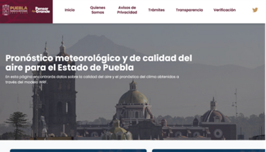
 
Figura 1. Version 1.0 de página de inicio 
 
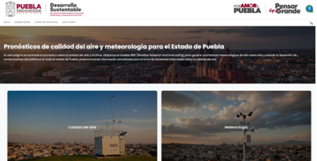

Figura 2. Version 2.0 de página de inicio 
**Desarrollo del mapa interactivo con capas dinámicas** 
- Implementación de sistema de capas interactivas que responden al usuario 
- Panel de “Control de Capas” con opciones de Precipitación, Temperatura, Humedad, Presión, Radiación y Viento 
- Selector de fechas y horas para visualización temporal 
- Visualización de datos actuales por municipio (temperatura, humedad, viento, presión) 
- Barra de búsqueda de municipios integrada al mapa 
- Leyenda dinámica con escalas de color según el parámetro seleccionado 
 
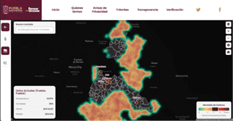

Figura 3. Version 1.0 de desarrollo del mapa interactivo con múltiples cápas y fondo negro 
 
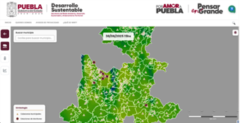

Figura 4. Version 2.0 de desarrollo del mapa interactivo con fondo blanco 
**Evolución del sistema de análisis histórico** 
- Transformación de ventana emergente inicial a sección dedicada completa 
- Implementación de gráficas de series temporales para cada variable meteorológica 
- Resumen de promedios (temperatura, humedad, presión, viento) 
- Tabla de datos históricos por unidades (°C, %, km/h, hPa) 
- Selector de tipo de datos: Meteorológicos vs Calidad del Aire 
- Funcionalidad de descargo de datos en formatos CSV 
 
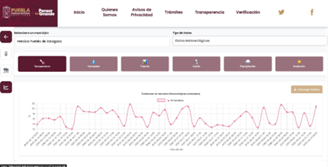

Figura 5. Version 1.0 del sistema de análisis histórico 
 


Figura 6. Version 2.0 del sistema de análisis histórico con funcionalidad de busqueda 
 
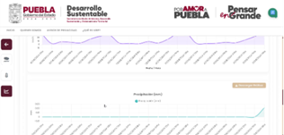

Figura 7. Version 2.0 del sistema de análisis histórico mostrando los tipos de datos 
**Rediseño completo de la interfaz** 
- Nuevo header con logos institucionales (Gobierno de Puebla, Desarrollo Sustentable, Por Amor a Puebla, Pensar en Grande) 
- Menú de navegación reorganizado: Inicio, Quiénes Somos, Avisos de Privacidad, ¿Qué es WRF? 
- Implementación de paleta de colores institucional 
- Rediseño de botones e iconos para mejor usabilidad 
 


Fig 8. Version 1.0 del header de la interfaz 
 


Figura 9. Version 2.0 del header de la interfaz con los nuevos logos institucionales 

**Sistema de visualización geográfica** 
- Cambio de visualización de capas de calor a mapas administrativos del Estado de Puebla 
- Simbología de estaciones de monitoreo en el mapa 
- Información contextual por municipio 
- Escala gráfica y controles de zoom optimizados 
- Vista general del estado con límites municipales claramente definidos 
 
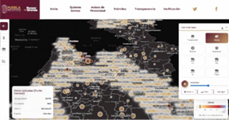

Figura 10. Version 1.0 de la visualización geográfica mostrando la opción de viento 
 


Figura 11. Version 1.0 de la visualización geográfica mostrando la opción de precipitación 
 
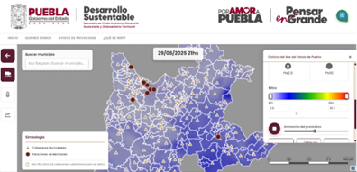

Figura 12. Version 2.0 de la visualización geográfica mostrando la opción de dióxido de carbono 
 
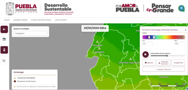

Figura 13. Version 2.0 de la visualización geográfica mostrando la opción de temperatura 
 
**Infraestructura y operación** 
Reconexión al servidor y restablecimiento de servicios: resolución de credenciales, llaves y enlaces, verificación de puertos de API y de servidor de datos. 
 
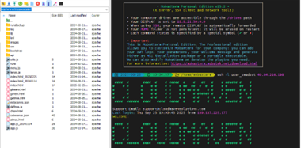
 
Figura 14. Terminal para reconectar al servidor y restablecer servicios 
**Gestión del dominio** 
Recuperación del dominio y restablecimiento de HTTPS: actualización y transferencia del registro, limpieza de DNS heredado, configuración de y renovación automática de certificados y redirección permanente a HTTPS. 
 
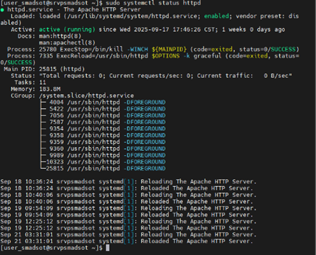
 
Figura 15. Terminal en donde se realizaron las operaciones para restablecer el dominio 
**Mantenimiento correctivo y evolutivo** 
- Bugs de funcionamiento: correcciones en render de capas del mapa, tiempos de respuesta de la API, manejo de caché y validación de parámetros. 
- Mejoras de UX: barra de búsqueda, control de capas más intuitivo, navegación coherente con el tema oscuro, y optimización responsiva para móviles. 
**Accesibilidad**  
- Texto a voz (TTS) para lecturas de resúmenes, alertas y descripciones del mapa. 
- Voz a texto (STT) para búsqueda de opciones y datos de municipios específicos. 
- Paletas y modos de color accesibles, alto contraste y esquemas aptos para miopía además de tamaño de fuente escalable. 
 


Figura 16. Menú de opciones de accesibilidad implementado en la página

---

## Documentación Técnica del Proyecto

### Arquitectura del Sistema

El sistema implementa una arquitectura de tres capas (3-tier) con separación clara de responsabilidades:

#### 1. Capa de Presentación (Frontend)
**Tecnologías**: HTML5, CSS3, JavaScript ES6+, Bootstrap 3.x, OpenLayers

**Componentes principales**:
- **Páginas de interfaz**: 
  - `index.html` - Landing page principal con navegación a secciones
  - `atmos.html` - Visualización de variables atmosféricas
  - `chem.html` - Visualización de variables de calidad del aire
  - `gatmos.html` - Gráficas históricas atmosféricas
  - `gchem.html` - Gráficas históricas de química atmosférica
  - `glosario.html` - Términos y definiciones técnicas

- **Módulos JavaScript**:
  - `app.js` - Inicialización de la aplicación y coordinación de módulos
  - `lienzo.js` - Gestión del canvas del mapa (OpenLayers), capas vectoriales y raster
  - `menu.js` - Control de navegación, menú lateral y UI responsive
  - `utils.js` - Funciones utilitarias (formateo de datos, conversiones, validaciones)
  - `defines.js` - Constantes globales, configuración de variables meteorológicas y químicas
  - `accesibility.js` - Funciones de accesibilidad (TTS, STT, alto contraste, zoom)

- **Estilos**:
  - `app.css` - Estilos principales de la aplicación
  - `css/estilos.css` - Estilos complementarios
  - `css/tooltips.css` - Estilos para tooltips informativos
  - `bootstrap/` - Framework CSS y componentes UI

#### 2. Capa de Lógica (Backend/API)
**Tecnología**: PHP 7.4+

**Ubicación**: `api/`

**Endpoints y servicios**:
- `api.php` - Controlador principal de la API REST
  - Manejo de peticiones GET/POST
  - Validación de parámetros de entrada
  - Enrutamiento a funciones específicas
  - Gestión de headers CORS y caché

- `getRuns.php` - Servicio de listado de corridas disponibles
  - Escaneo del directorio `runs/`
  - Retorna JSON con fechas/horas disponibles
  - Filtra corridas válidas y completas

- `funciones_ICA.php` - Cálculo de Índice de Calidad del Aire
  - Algoritmos de conversión de concentraciones a ICA
  - Clasificación por niveles (Bueno, Moderado, Malo, etc.)
  - Funciones auxiliares de procesamiento de datos

**Configuración**:
- `- copia.htaccess` - Reglas de reescritura y configuración Apache
  - Redirecciones a HTTPS
  - Habilitación de CORS
  - Configuración de cache headers

#### 3. Capa de Datos
**Almacenamiento**:
- `runs/` - Directorio de salidas del modelo WRF-Chem
  - Estructura: `runs/YYYYMMDDHH/` (ejemplo: `2025103100`)
  - Contiene archivos NetCDF, GeoTIFF o JSON con resultados del modelo
  - Metadatos de configuración de cada corrida

**Archivos de configuración y datos estáticos**:
- `cabeceras.json` - Coordenadas de estaciones de monitoreo
- `estaciones.json` - Información detallada de estaciones (nombre, ubicación, tipo)
- `puebla_coordinates.json` - Geometrías de municipios del estado
- `puebla_state_boundary.json` - Límites estatales en formato GeoJSON
- `color_scale.csv` - Definición de paletas de colores para visualización
- `kml/` - Archivos KML para compatibilidad con Google Earth

### Estructura de Directorios

```
Meteorologia/
├── index.html              # Página principal
├── atmos.html              # Vista atmosférica
├── chem.html               # Vista química
├── gatmos.html             # Gráficas atmosféricas
├── gchem.html              # Gráficas químicas
├── glosario.html           # Glosario técnico
│
├── app.js                  # Aplicación principal
├── lienzo.js               # Motor de visualización de mapas
├── menu.js                 # Sistema de navegación
├── utils.js                # Utilidades generales
├── defines.js              # Constantes y configuración
├── accesibility.js         # Módulo de accesibilidad
│
├── api/                    # Backend PHP
│   ├── api.php             # API REST principal
│   ├── getRuns.php         # Servicio de corridas
│   ├── funciones_ICA.php   # Cálculos de ICA
│   └── - copia.htaccess    # Configuración Apache
│
├── css/                    # Estilos personalizados
│   ├── estilos.css
│   └── tooltips.css
│
├── bootstrap/              # Framework UI
│   ├── bootstrap.min.css
│   ├── bootstrap.min.js
│   ├── datepicker/
│   ├── dialog/
│   ├── dropdowns/
│   ├── slider/
│   └── fonts/
│
├── lib/                    # Bibliotecas externas
│   ├── jquery.min.js       # jQuery 3.x
│   ├── chart.min.js        # Chart.js para gráficas
│   ├── dom-to-image.js     # Exportación de imágenes
│   ├── ol-ext.js           # Extensiones OpenLayers
│   └── ol/                 # OpenLayers 5.3.0
│
├── images/                 # Recursos gráficos
│   ├── bar_*.png           # Escalas de colores por variable
│   ├── header/             # Logos institucionales
│   ├── Tarjetas/           # Imágenes de tarjetas informativas
│   └── backup/             # Respaldo de imágenes
│
├── kml/                    # Archivos KML
│   ├── cabeceras.kml
│   └── puebla.kml
│
├── runs/                   # Salidas del modelo WRF-Chem
│   └── YYYYMMDDHH/         # Corridas por fecha/hora
│
└── *.json                  # Archivos de configuración
    ├── cabeceras.json
    ├── estaciones.json
    ├── puebla_coordinates.json
    └── puebla_state_boundary.json
```

### Flujo de Datos

#### Flujo de visualización del mapa:
1. **Inicialización**: Usuario accede a `atmos.html` o `chem.html`
2. **Carga de aplicación**: `app.js` inicializa módulos y configuración
3. **Consulta de corridas**: AJAX a `api/getRuns.php` para obtener fechas disponibles
4. **Selección de parámetros**: Usuario selecciona variable, fecha y hora
5. **Solicitud de datos**: AJAX a `api/api.php` con parámetros de consulta
6. **Procesamiento backend**: PHP lee archivos en `runs/`, extrae datos y retorna JSON
7. **Renderizado**: `lienzo.js` recibe datos y renderiza capa en mapa OpenLayers
8. **Interacción**: Usuario puede hacer zoom, pan, consultar valores por municipio

#### Flujo de gráficas históricas:
1. **Acceso a sección**: Usuario navega a `gatmos.html` o `gchem.html`
2. **Selección de estación**: Usuario selecciona estación de monitoreo
3. **Rango temporal**: Usuario define periodo de consulta
4. **Consulta API**: Petición a `api/api.php` con parámetros de serie temporal
5. **Agregación de datos**: Backend lee múltiples corridas y agrega datos
6. **Respuesta JSON**: API retorna serie temporal estructurada
7. **Visualización**: Chart.js renderiza gráficas interactivas
8. **Exportación**: Usuario puede descargar CSV o imagen de gráfica

### Especificaciones Técnicas

#### Frontend
- **OpenLayers 5.3.0**: Biblioteca de mapas web
  - Proyección: EPSG:3857 (Web Mercator)
  - Capas base: OpenStreetMap, cartografía personalizada
  - Capas vectoriales: GeoJSON de límites municipales y estaciones
  - Capas raster: Datos interpolados del modelo WRF-Chem

- **Chart.js 2.x**: Visualización de series temporales
  - Tipos de gráfica: líneas, barras, área
  - Interactividad: tooltips, zoom, pan
  - Exportación: PNG/SVG vía dom-to-image.js

- **Bootstrap 3.x**: Framework CSS responsive
  - Grid system de 12 columnas
  - Componentes: modals, dropdowns, datepicker, slider
  - Personalización vía variables LESS/SASS

#### Backend
- **PHP 7.4+**: Lenguaje del servidor
  - Extensiones requeridas: json, curl, mbstring
  - Configuración: memory_limit >= 256M, max_execution_time >= 120s

- **Formato de datos**: JSON para intercambio cliente-servidor
  ```json
  {
    "run": "2025103100",
    "variable": "t2m",
    "timestamp": "2025-10-31T06:00:00Z",
    "data": [
      {"lat": 19.041, "lon": -98.206, "value": 18.5},
      ...
    ]
  }
  ```

#### Datos del modelo
- **WRF-Chem**: Weather Research and Forecasting model with Chemistry
  - Resolución espacial: ~4km (configurable)
  - Resolución temporal: horaria
  - Variables atmosféricas: temperatura, humedad, presión, viento, precipitación, radiación
  - Variables químicas: PM2.5, PM10, O3, NO2, SO2, CO

### Patrones de Diseño Implementados

1. **Module Pattern** (JavaScript):
   - Encapsulación de funcionalidad en módulos independientes
   - Namespace global mínimo para evitar colisiones
   - Ejemplo: `lienzo.js`, `menu.js` exponen interfaces públicas

2. **Observer Pattern**:
   - Eventos personalizados para comunicación entre módulos
   - Listeners en elementos del DOM para interactividad

3. **Lazy Loading**:
   - Carga diferida de datos del modelo bajo demanda
   - Descarga de imágenes y recursos pesados solo cuando son necesarios

4. **RESTful API**:
   - Endpoints semánticos (GET para consultas, POST para operaciones)
   - Respuestas en formato JSON estándar
   - Códigos de estado HTTP apropiados

### Seguridad

- **HTTPS obligatorio**: Redirección automática de HTTP a HTTPS
- **Validación de entrada**: Sanitización de parámetros en API PHP
- **CORS controlado**: Headers configurados para dominios autorizados
- **Rate limiting**: Limitación de peticiones para prevenir abuso (configurable en Apache)
- **SQL Injection prevention**: Uso de consultas preparadas (si se implementa BD en futuro)

### Rendimiento y Optimización

- **Caché de navegador**: Headers Cache-Control para recursos estáticos
- **Minificación**: Archivos JS/CSS minificados en producción
- **Compresión gzip**: Habilitada en Apache para transferencias
- **CDN ready**: Estructura compatible con Content Delivery Networks
- **Imágenes optimizadas**: PNGs comprimidos, SVGs para logos cuando posible

### Mantenimiento y Extensibilidad

**Agregar nueva variable meteorológica/química**:
1. Definir en `defines.js` (nombre, unidad, rango, escala de color)
2. Crear imagen de escala en `images/bar_VARIABLE.png`
3. Actualizar lógica de extracción en `api/api.php`
4. Probar visualización en mapa y gráficas

**Agregar nueva estación de monitoreo**:
1. Actualizar `cabeceras.json` con coordenadas
2. Actualizar `estaciones.json` con metadata
3. Sincronizar con KML si es necesario (`kml/cabeceras.kml`)

**Implementar nueva vista/página**:
1. Crear HTML basado en plantilla de `index.html`
2. Incluir dependencias comunes (jQuery, Bootstrap, OpenLayers)
3. Inicializar módulos requeridos en script de página
4. Agregar entrada en `menu.js` para navegación

### Dependencias del Proyecto

**Frontend**:
- jQuery 3.6.0
- Bootstrap 3.3.7
- OpenLayers 5.3.0
- Chart.js 2.9.4
- dom-to-image 2.6.0
- ol-ext (extensiones OpenLayers)

**Backend**:
- PHP >= 7.4
- Apache 2.4+ (con mod_rewrite, mod_headers)
- Extensión PHP JSON
- Extensión PHP cURL (opcional, para servicios externos)

**Sistema**:
- WRF-Chem (corriendo en servidor de modelación)
- Servidor web (Apache/Nginx)
- Certificados SSL/TLS para HTTPS
- Espacio en disco: ~10GB por mes de corridas (dependiendo de configuración)

### Guía de Despliegue

**Requisitos previos**:
1. Servidor con Apache/PHP instalado y configurado
2. Certificado SSL válido
3. Acceso SSH al servidor
4. Permisos de escritura en directorio `runs/`

**Pasos de instalación**:
1. Clonar/copiar el directorio `Meteorologia/` al servidor web
2. Configurar virtual host de Apache apuntando al directorio
3. Habilitar mod_rewrite: `sudo a2enmod rewrite`
4. Copiar y renombrar `api/- copia.htaccess` a `api/.htaccess`
5. Configurar permisos: `chmod 755 runs/` y `chmod 644 api/*.php`
6. Verificar extensiones PHP: `php -m | grep -E 'json|curl'`
7. Reiniciar Apache: `sudo systemctl restart apache2`
8. Acceder a `https://dominio.com/Meteorologia/` para verificar

**Configuración de corridas automáticas**:
1. Configurar cron job para ejecutar WRF-Chem
2. Script post-procesamiento para copiar salidas a `runs/YYYYMMDDHH/`
3. Verificar formato y estructura de datos de salida
4. Probar endpoint `api/getRuns.php` retorna corrida nueva

### Resolución de Problemas Comunes

**Problema**: Mapa no carga o muestra error
- Verificar consola del navegador (F12)
- Confirmar que archivos GeoJSON están accesibles
- Revisar permisos de lectura en directorio `Meteorologia/`

**Problema**: API no retorna datos
- Verificar logs de Apache: `/var/log/apache2/error.log`
- Confirmar que directorio `runs/` contiene corridas
- Revisar sintaxis PHP en archivos `api/*.php`

**Problema**: Gráficas no se renderizan
- Confirmar carga de Chart.js en consola del navegador
- Verificar formato JSON de respuesta de API
- Revisar que datos no estén vacíos o null

**Problema**: Certificado SSL expirado
- Renovar certificado: `sudo certbot renew` (si usa Let's Encrypt)
- Verificar configuración en Apache: `/etc/apache2/sites-available/`
- Reiniciar Apache tras actualización


### Contacto y Soporte

Para reportar bugs, solicitar nuevas funcionalidades o consultas técnicas:
- Branch actual: `features/json`
- Responsable técnico: Equipo de desarrollo SMADSOT
"# ss-f1" 
